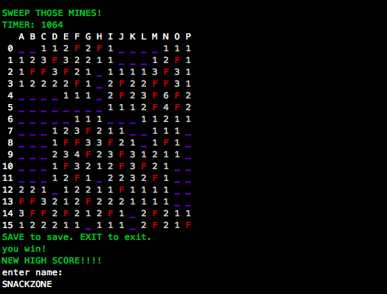

# Fair Minesweeper

Short Project Description:

Effekt implementation of the fair minesweeper game. Fair minesweeper is like the classical minsweeper but with two additional features:

1. If the user, judging by the state of the board, could not be sure that a mine was not on any square,
   a mine is not on that square after uncovering any square
2. Conversely, if the user could have been certain that a mine was not on any square, but still
   uncovered a square on which he could not have been certain, the mine is on that square

`=>` the current state and features of the project as well as the next steps planned can be found [here](https://github.com/lenakaeufel/epe-project-fair-minesweeper/blob/main/nextSteps.md)

## Must-have

Features that I 100% promise to be done

- minesweeper game in one difficulty level (Beginner: 9x9 board with 10 mines)
- a solver for the game (related to can have feature hints: use this solver for hints?!)
- terminal representation of the game:
  - see the current board displayed in the terminal, a bit similar to this:
    
  - user can input the coordinates (x,y) of a field as well as what he wants to do with it (uncover(u)/flag(f)), with a representation like (x,y,u/f)
  - handle wrong user inputs that don't match the representation and tell the user what he did wrong(e.g. x and y out of board size, third input has to be u or f, wrong number of inputs,...)
  - game over message (can have: nice/funny game over screen) + try again possibility
  - winning message (can have: nice/funny winning screen) + try again possibility
- user can unflag a previously flaged cell
- explanation of the rules when player starts the game (+ user can input something like "rules" to show the rules again)
- ability to quit the game before finishing by pressing some key
- print all the inputs a user can do under the game screen (something like "press XX to quit the game", "press XX to show the rules again", "input coordinates in the format XX to make a move", "press XX to restart the game", ...)
- generating a random board each time the user starts the game
- correct implementation of all the basic rules of minesweeper as well as the two additional rules for fair minesweeper

  - Also implement chording: when an uncovered square with a number has exactly the correct number of adjacent squares flagged, performing a click with both mouse buttons on it (in my representation probably just trying to uncover the field with the number and if enough flags are around it, perform the chording, if not, tell the user this is not a valid move) will uncover all unmarked squares; This is called a Chord.

- always notice when game is won as soon as all fields without a mine are uncovered and finish the game with the winning screen

## Can-have

Features that might or might not be done

- more built in difficulty levels (e.g. Intermediate 16x16 with 40 mines, Advanced 24x24 with 99 mines)
- user specified difficulty of the game (board size, number of mines)
- different game modes (timer, hints, losing a life instead of immediate game over when uncovering bomb, no flags allowed)
- record and show the player some stats (e.g. time he needed for solving, efficiency(# of clicks))
- using emojis to display the game in a nicer way
- making it a web application with a nice GUI (clicking the fields to place flags, uncover)
- store high scores (total high score, high score by player name) also when game is closed and restarted (file writer?!)

## Will-not-have

Features that I definitely won't have

These were generated by Claude because initially I didn't have any idea on what to write here and it did a pretty good job IMO :P

- Multiplayer functionality
- Sound effects
- Custom themes or skins
- Undo/redo functionality
- Save/load game state between sessions
- AI opponent mode
- Tutorial mode with guided gameplay
- Automated gameplay recording
- Social sharing features
- ...

## Effects and handlers

What effects and handlers am I planning to use and how?
(There should be some fun ones, the language is called _Effekt_ after all...)

This is maybe a bit vague and parts won't work out like this because I find it very hard to state this before actually implementing.. but I've tried :D

Effects:

- **finish** Effect for finishing the game
  - parameters: Boolean won?, final Board
  - used for: Displaying final board state (bidirectional effect throwing display?), winning/game-over messages, prompting for new game
- **display** Effect for displaying different things like the current board, the rules, winning/game over screen,...

- **state** Effect to get the current game state (board, optional timer, move count)

- **modify**: Effect for board modifications

  - parameters: position (x,y), action (uncover/flag/remove flag), playerboard, actual board
  - used for: Updating game board state following player actions

- **random**: Effect for random number/mine generation

  - used for: Generating mine positions, ensuring fair mine placement

- **wrongInput**: Effect to tell the user the input was not valid (different effects for different kinds of errors like index not in board, wrong number of inputs,...)

- **input**: Effect for user input handling

  - used for: Reading and validating coordinate inputs

- **solver**: Effect for a solver for minesweeper

  - parameters: current board

- a custom representation of the board

Handlers:

- handler for I/O to actually display board (handles finish/display/wrongInput)
- handler for the state effect to return the current state of the board
- handler for ensuring fair mine placement (handles the random effect)
- handler for the input effect -> validates the input regarding the format and throws wrongInput effect if input doesn't match the input format. If the format was correct checks if move wasn't already done before (matches the board) and throws modify effect to modify the board in case it's a truly valid move.
- handler for the solver, makes next steps of the solver based on minesweeper rules,analyzing current board state safe moves, determined mine positions (use patterns?!)
- handler for the modify effect to actually modify the current board of the user/ return new board. Check here if game is won? If not, where else?

## FFI and libraries

What FFI/libraries will I need? What is their current status?
(This is so that we both can estimate how much time you'll have to spend on writing glue code.)

Status:

✅ = library/FFI already there, can be used just as it is

❌ = library/FFI not there/not immediately usable

Libraries:

- ✅ string/tty for colored representation of the board in the terminal
- ✅ io/console for getting user inputs from the terminal
- ❌ random int function to generate boards randomly
- optional: ✅ io/console for can-do feature of globally stored highscores??
- optional: ✅ bench -> functions for measuring the time the player needed until finishing the game
- optional: ❓ libraries, FFI needed to make it a web application (compare to ex-5?!)

## Possible resources and other ideas:

- [patterns](https://minesweeper.online/de/help/patterns) (to be used in solver/for hints?!)
- [example implementation](https://www.geeksforgeeks.org/cpp-implementation-minesweeper-game/) of minesweeper in C++
- for the implementation: maintain two boards: one that's displayed to the player, including all of his moves so far and one that can't change (except for maintaining the rules of fair minesweeper, first move) and holds the solution with all hidden mines
- [minesweeper task for comparison](https://itp.uni-frankfurt.de/~mwagner/teaching/C_WS17/projects/Minesweeper.pdf)
- [example solver for regular minesweeper](https://github.com/mrgriscom/minesweepr/?tab=readme-ov-file)
