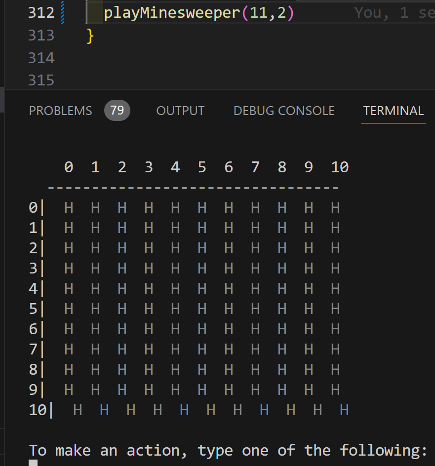

To organize/structure the project, the next steps I want to do will always be added here

❌ = not started yet

🛠️ = currently under construction

✅ = done

🟡 = works for now but improvements planned

### Sixth Week: 07.01. - 13.01.2025

- ❌ Restarting the Game:

  - after a Game was lost/won, ask if user wants to play again instead of immediately quitting the game
  - add possibility to restart the game (as an action, e.g. "press r to restart the game") during a running game
  - clear the terminal after a restart

- ❌ implement solver

- ❌ implement Fair rules:

  1. If the user, judging by the state of the board, could not be sure that a mine was not on any square,
     a mine is not on that square after uncovering any square
  2. Conversely, if the user could have been certain that a mine was not on any square, but still
     uncovered a square on which he could not have been certain, the mine is on that square

  - ideas on how to implement this:
  - replacing mines: the only possible cells on which we can place a new mine are cells that Hidden are surrounded only by cells that are Hidden themselves. Otherwise the player would notice we've changed the board which is giving him hints we don't want to give
  - when do we need to replace a mine:
    1. if it's the first move and there's a mine on the picked cell (TODO: check if this has to be special case)
    2. if for none of the covered cells the user can be sure there is no mine on it (e.g. computing probability of being a mine for each Hidden cell that is a direct neighbor of an uncovered cell. If none of these probabilities is 0%, we can't be sure where the mine is. So here, if the mine is on the cell the user tries to uncover, we have to replace it by a not mine cell.) -> fair rule `1`
  - fair rule `2`: compute the probabilities again, if one is 0% but the user picked one that is not 0, the mine is on that square -> the user looses (special case of game over, tell the user the fair rule was used and highlight the cell that should have been uncovered instead (had probability 0))
  - needed functions and functionality:
    - determine the first move
    - compute probability of a cell being a mine:
    - interestingCells: find the cells that are uncovered and have at least on Hidden neighbour
    - candidateCells: finds the cells that are Hidden and direct neighbors of uncovered Cells
    - generateRules: generate Rules out of the candidate Cells. A rule is of form Rule(numMines: Int, candidates: Set[Cell]) where numMines comes from one of the already uncovered cells (so the number of rules generated is always the same as the number of uncovered cells surrounded by at least on hidden cell (= interestingCell)) and is the number of mines that has distributed by the candidates
    - computeProbabilites: looks at all of the generatedRules and computes the probability for each candidate Cell being a mine. Output is of the form List[coordinate: (Int,Int), probability: Double[0,1]]
    - replacableCells: finds first cell that can hold a mine and outputs it's index or throws effect if there is none
    - replaceMine: run replaceableCell. If it returns a position, place the mine that's being replaced onto that new position, updating all the cells around it (neighboursOf). If there is no position (replacableCells throwing), for now just remove the mine from the current cell and don't place it anywhere else -> there is now one mine less in the game. Not perfect, but currently don't know better way and should not happen very often

- 🟡 fix flood fill
  - flood fill only worked for small board (size 4). For bigger boards it seemed to be stuck in an infinite loop
  - the problem causing this was that the list of visited cells was reset for each new recoursive call
  - `=>`it now works, but the game now takes ~ 30 seconds to start which is too long -> how to speed this up?

### Fifth Week: 24.12. - 30.12.2024 and Holidays until 06.01.2025

- 🛠️ Problem with Represenation of the Board:

  - what is best representation??
  - with the current representation (Number(n), Hidden, Mine, Flag) problem: weird that solution and player board have the same type but only use subsets of the possible CellStates. Could be problematic when including the fair rules (need information on which cells of the board are already still hidden when we modify solution board, but solution board doesn't have information on hidden cells)
  - two different data types one for player board and one for solution board seems like a bad solution for this problem (need printing,... functions for both types -> lots of duplicate code)
  - adding booleans for hidden and flagged cells and make only possibilities for CellState Number and Mine seems like a better solution regarding passed information and makes more sense, but we have to match for many different cases -> code get's more complicated/less readable (e.g. instead of Hidden() we see Number(...,true,...))
  - any other, better solution?

- ✅ add functionality to win/loose the game

  - game over when uncovering a mine -> display message, ❌ ask to return to landing screen/quit
  - won when all cells without a mine are uncovered -> display message, ❌ ask to return to landing screen/quit
  - `=>` done if winning/loosing a game is working correctly

- 🟡 add interaction with the terminal:

  - when starting the game, first some landing screen is displayed ("Welcome to Fair Minesweeper, to start a new game, press Enter on your keyboard")
  - once Enter is pressed, generate a new board and display it to the user (here two representation, player board is only Hidden cells here)
  - display new message: "to make a move, press the corresponing keys:
    a number greater/equal to 0 for row and col, an action out of [u(ncover),f(lag),r(emove flag)], q to quit the game"
  - "what's the row of your move?"-> player presses key
  - "what's the col of your move?"-> player presses key
  - "what action do you want to do?" -> player presses key
  - display new board after the action if the action was valid
  - display correct error message in case any invalid key was pressed
  - `=>` done if all of the above features are working. Winning/loosing is not in scope here, so the game can only end with the user pressing q

- ✅ add functionality for players:

  - function to validate player's moves (coordinates in board range, trying to uncover an already uncovered cell (Number cell))
  - unflagging a previously flagged cell should be possible
  - terminal interaction currently not in scope, only function that get's a move and returns the new board after the move
  - maintain a new board for players, create it based on size of previously generated solution board
  - recursively uncover adjacent cells when uncovering an empty cell (🟡 floodFill algorithm)
  - `=>` done if a move can be made by calling some function. The move has to be a valid one, otherwise the correct error message get's displayed. In case of uncovering an empty cell, the [floodFill](https://en.wikipedia.org/wiki/Flood_fill) algorithm is used to recursively uncover neighbouring number cells

- 🟡 when printing a board, display a line to seperate between the coordinates and the actual board content
- ✅ remove EmptyCell() and match for Number(0) in printRow instead?
- ✅ add functionality for random placement of mines (create initial board)

  - therefore function(s) to check/maintain the rules (e.g. max 8 mines around each field,...)
  - functionality for players not in scope here, just static board generation
  - mine placement function parametrized by total number of mines
  - idea: input desired number of mines and just place this number of mines at random coordinates on the board (check that coordinates are unique -> no two mines on the same field). Then for each field count the numbers of mines surrounding it (max 8) -> special case: edges (max 3) and borders (max 5). If the number is 0, it's displayed as an empty cell, else the number gets shown
  - `=>` done if a random, correct(correct numbers,...) board can be generated automatically

### Fourth Week: 17.12. - 23.12.2024

- didn't really do anything new

### Third Week: 10.12. - 16.12.2024

- 🛠️ add functionality for random placement of mines (create initial board)

  - therefore function(s) to check/maintain the rules (e.g. max 8 mines around each field,...)
  - functionality for players not in scope here, just static board generation
  - mine placement function parametrized by total number of mines
  - idea: input desired number of mines and just place this number of mines at random coordinates on the board (check that coordinates are unique -> no two mines on the same field). Then for each field count the numbers of mines surrounding it (max 8) -> special case: edges (max 3) and borders (max 5). If the number is 0, it's an EmptyCell, else it's Number cell.
  - check for valid input when generating the board (negative inputs, numMines > size)
  - `=>` done if a random, correct(correct numbers,...) board can be generated automatically

### Second Week: 03.12. - 09.12.2024

- didn't really have time to continue working on the project :(

### First week: 26.11. - 02.12.2024

- ✅ implement representation of the board:

  - data type to store the board in (possible states of a cell: Flag, Bomb, empty, Number and for the player board: hidden or uncovered (-> boolean?))
  - function for updating the state of a field (updateCell)
  - function for printing the board
  - use updateAt function in updateCell
  - `=>` done if an example board can be printed in the terminal correctly and cells can be updated

---

### Rest of the project:

- maintain two boards: one to store the solution in, one for the current state of the player

  - the solution board has no flags, only bombs, numbers and empty fields
  - the player board has no bombs, only flags, numbers and empty fields
  - special case: display bomb/all bombs? when game is lost to the user

- ❌ add functionality for validating player moves

  - make sure fair minesweeper rules + first move rule are maintained
  - again, actual functionality for players (terminal interaction,...) not in scope
  - `=>` done if a given move of the player can be validated by maintainig the rules

- 🛠️ add emojis to represent the board cells

- remove EmptyCell() and match for Number(0) in printRow instead?

- in generateBoard: effect to generate player board?

- improve (invalid input) messages

- flood fill seems to be slow in some cases -> how to improve speed? (idea: when Set is available, use Set here?)

- improve general look of the game (use "fancy" things of tty library, bold letters, colors,...)

- use more effects where possible

- write good Documentation

- Clean up (shorter functions, move functions to separate files, improve names, ...)

---

### Weird bugs:

- when size of the board is >= 11, the formatting becomes weird:
  

---

- possible property tests:
  - only player boards can have hidden cells
  - a player board can't have a Mine on it (bc then the game should already be lost)
  - as soon as a Cell containing a Mine is revealed, the game is lost
  - mine counting works correctly
  - flood fill works correctly
