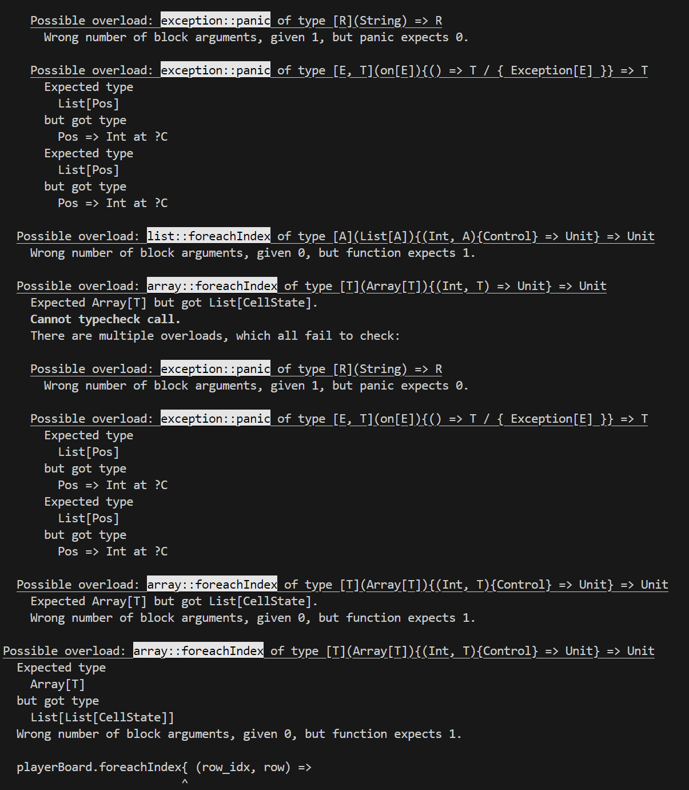
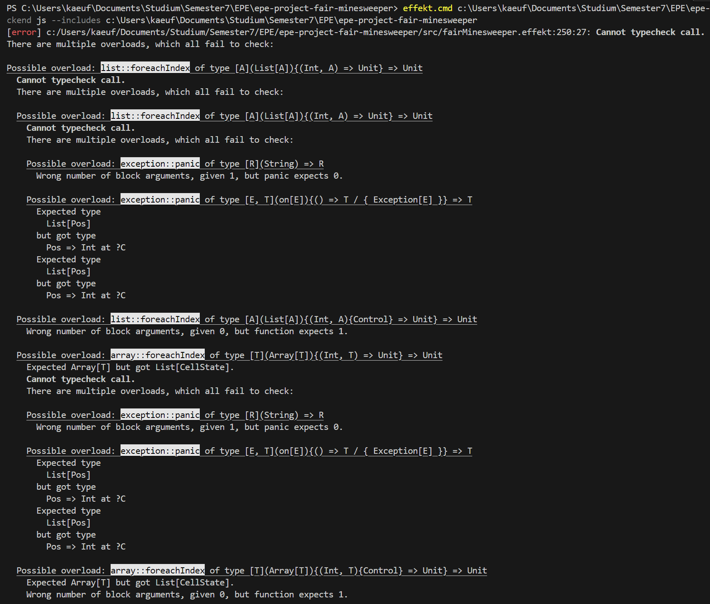

Technical problemjs:




wrong code:

````
def generateRules(playerBoard: Board): List[Rule] = {
  var rules: List[Rule] = []
  playerBoard.foreachIndex{ (row_idx, row) =>
    row.foreachIndex{ (col_idx, col) =>
      with on[OutOfBounds].panic
      playerBoard.get(row_idx).get(col_idx) match {
        case Number(n) => // cells with Numbers can be interesting (if they have >= 1 Hidden neighbour)
          val neighbours = collectList[Pos]{neighboursOf(playerBoard.size,Pos(row_idx,col_idx), 1)}
          var nextUncoverCandidates: List[Pos] = []
          var interesting = false
          neighbours.foreach{nb =>
            with on[OutOfBounds].panic
            playerBoard.get(nb.r).get(nb.c) match {
              case Hidden() => nextUncoverCandidates = Cons(nb,nextUncoverCandidates)
              case Flagged() => nextUncoverCandidates = Cons(nb,nextUncoverCandidates)
              case _ => nextUncoverCandidates = nextUncoverCandidates
            }
          }
          if(not(nextUncoverCandidates.isEmpty)) rules = Cons(Rule(n,c),rules)
        case _ => rules = rules // mines on player board not possible
      }
    }
  }
  println("rules "++ genericShow(rules))
  rules
}```
````

correct code

````
def generateRules(playerBoard: Board): List[Rule] = {
  var rules: List[Rule] = []
  playerBoard.foreachIndex{ (row_idx, row) =>
    row.foreachIndex{ (col_idx, col) =>
      with on[OutOfBounds].panic
      playerBoard.get(row_idx).get(col_idx) match {
        case Number(n) => // cells with Numbers can be interesting (if they have >= 1 Hidden neighbour)
          val neighbours = collectList[Pos]{neighboursOf(playerBoard.size,Pos(row_idx,col_idx), 1)}
          var nextUncoverCandidates: List[Pos] = []
          neighbours.foreach{nb =>
            with on[OutOfBounds].panic
            playerBoard.get(nb.r).get(nb.c) match {
              case Hidden() => nextUncoverCandidates = Cons(nb,nextUncoverCandidates)
              case Flagged() => nextUncoverCandidates = Cons(nb,nextUncoverCandidates) // TODO check!! This should fix bug that probabilites are empty after flagging a cell while no probability was 0
              case _ => nextUncoverCandidates = nextUncoverCandidates
            }
          }
          if(not(nextUncoverCandidates.isEmpty)) rules = Cons(Rule(n,nextUncoverCandidates),rules)
        case _ => rules = rules // mines on player board not possible
      }
    }
  }
  println("rules "++ genericShow(rules))
  rules
}```
````
